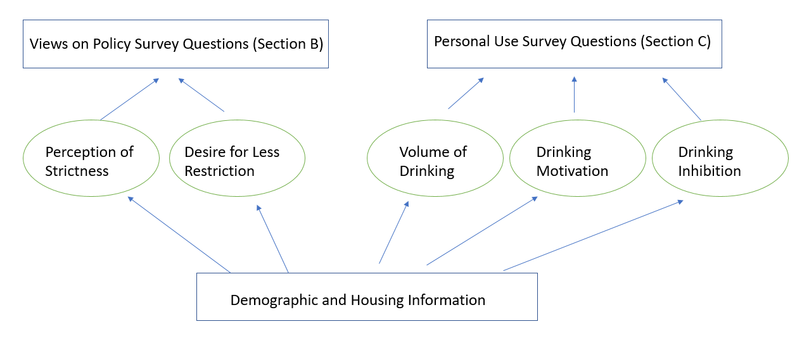
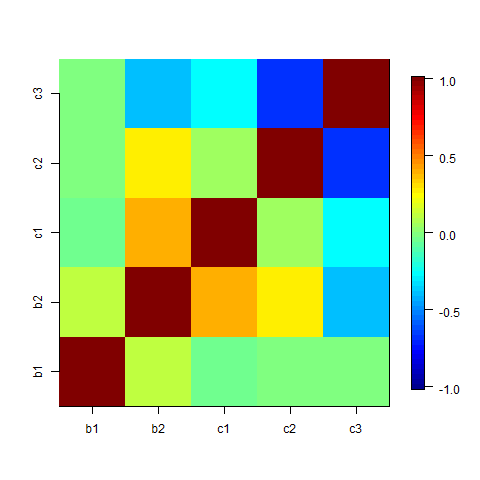
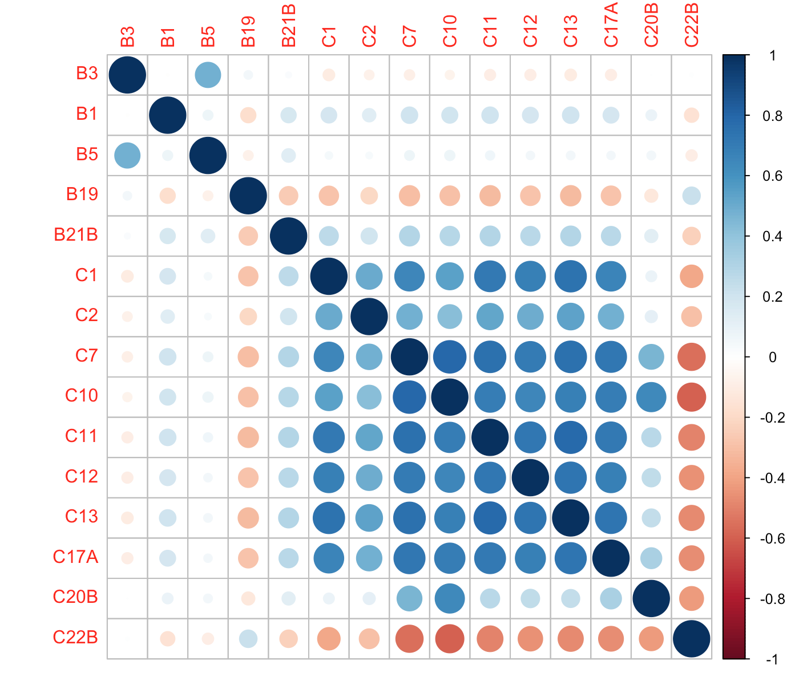

```{r setup, include=FALSE}
library(dplyr)
library(ggplot2)
library(knitr)
opts_chunk$set(
    echo = FALSE,
    fig.align = "c", fig.width = 6, 
    out.width = "3in", out.height = "2.25in")

cas01 <- read.csv("data/HarvardCAS01.csv")
```

## Objective

- Data: 2001 Harvard College Alcohol Study (CAS)
    
    - `r nrow(cas01)` participants (unknown response rate)

- Goal: Investigate the correlation structure between __subjective beliefs about campus alcohol policy__ and __objective measures of alcohol consumption__
    
    - _Section B_ for subjective questions, _Section C_ for objective questions

- Standard survey modeling techniques: factor analysis, structural equations model, item response theory

## Data Processing

- Consistent ordering of responses

    - More stringent alcohol policy beliefs (1) -> Less stringent 
  
    - Less alcohol consumption (1) -> More consumption

- Aggressive pruning of the variables before modeling 
    
- Unreliable responses classified based on
    
    - Response to A7: A (alone) is not allowed with other responses (family/partner/roommate)
        
    - Response in Section C: participants who chose 1 in C10 and answered C11--C15, etc.

- `WEIGHT01` used as sampling weights (intended for cross-sectional studies) 

## Missing Reponses

- Missing response rate adjusted for questions that only target certain demographic subgroups

```{r fig1_missing}
include_graphics("figures/missing_per_person.png")
```

- After adjustment missing rate quite low - around or below 10 percent

## Questions Included

* Section B: B1, B3, B5, B19, B21
* Section C: C1, C2, C7, C10, C11, C12, C13, C17, C20, C22
* Predictors/Exogenous: Section A, F5, G1, G2, G3, G4, G7, G8, G13

## Graphical Representation of the Model

```{r graph, out.width = "4in", out.height = "3in"}

```

## Structural Equations Modeling (SEM)

- Survey responses $X_i$ can be grouped together as repeated measurements of a lower-dimensional, latent _factors_: alcohol beliefs, alcohol consumption attitude, ...
  
- Factor analysis identifies the loadings $\Lambda$ of (scaled/centered) latent variable $\eta_i$.
  $$X_i = \Lambda\eta_i + \epsilon_i,\; \epsilon_i\stackrel{iid}{\sim} N(0,\sigma^2)$$

- Structural Equations Models extend factor analysis by specifying within-question correlations and regressing $\eta_i$ on exogenous $Z_i$'s:
  $$\eta_i = B \eta_i + \Gamma Z_i + \nu_i, \nu_i\stackrel{iid}{\sim} N(0,\tau^2)$$

    * All of our model predictors are directly observed rather than "manifested" by questions: age, gender, etc.
    
    * Causal interpretation is __not__ necessary (though often made!).

## Modeling Challenges

  - The model is clearly misspecified: Gaussian error assumption is made on ordered response
  
    * Asymptotic standard errors of factor loading estimators are valid for nonnormal factor analyses (Anderson and Amemiya, 1988)
    
    * In practice can cause lower goodness-of-fit
    
  - Complete case analysis due to excessive computation in maximizing the full likelihood

## Main Results

2 factors corresponding to Section B of the survey

    * B1: Perception of strictness in school's alcohol policy
    * B2: Desire for less restrictive alcohol policies

3 factors corresponding to Section C of the survey

    * C1: Volume of Drinking
    * C2: Motivation for Drinking
    * C3: Inhibition towards Drinking

## Main Results

```{r factor cor, out.width = "4in", out.height = "3in", fig.cap="\\label{fig:factor_cor}Correlation between latent factors"}

```

## Interpretation of Factors

* Strictness Perception uncorrelated with other factors

* Desire for less restrictive policy correlated with drinking volume (+) and inhibition (-)

* Drinking volume uncorrelated with motivation

* Motiviation and inhibition negatively correlated

## Model Diagnostics

  - Various statistics to evaluate model fit in practice (and suggested threshold indicating good fit): CFI (> .95), RMSEA (< .08), SRMR (< .06) (See Hu and Bentler, 1999)
  
  - Goodness of fit statistics for our model:
  
    CFI: 0.866, RMSEA: 0.041, SRMR: 0.027
    
## Implication: Survey Questions

```{r model_cor, out.width = "4in", out.height = "3in", fig.cap="\\label{fig:model_cor}Implied correlation between questions"}

```

## Implication: Survey Questions

- __B3 and B5__: Students who believe current policy is lenient want even _more_ lenience

- __B19__: Minimal drinking age question negatively correlates with alcohol consumption
    * Positive correlation with C22 sub-questions (more dependence on alcohol to resolve problems)

- Between-section correlation is weak except for certain prominent questions: B19, B21

## Future Imporvements

  * Better model to account for ordinal response
  
  * Theory-driven priors may improve fit of more complex models
  
  * Need information to correct for estimate biases
  
## Reference

  - "Asymptotic Chi-Square Tests for a Large Class of Factor Analysis Models," Anderson, T. W. and Amemiya, Y. _The Annals of Statistics_, 16(2), 1988.
  
  - "Cutoff criteria for fit indexes in covariance structure analysis: Conventional criteria versus new alternatives," Hu, L.-T. and Bentler, P. M. _Structural Equation Modeling: A Multidisciplinary Journal_, 6(1), 1999.


