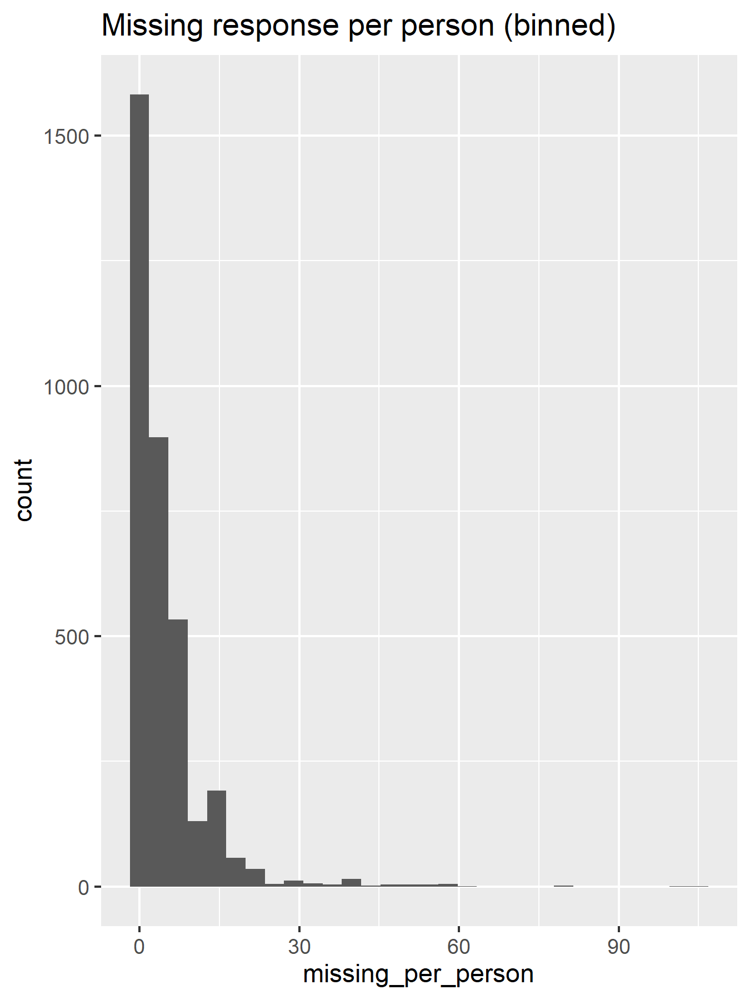

```{r setup, include=FALSE}
library(dplyr)
library(ggplot2)
library(knitr)
opts_chunk$set(
    echo = FALSE,
    fig.align = "c", fig.width = 6, 
    out.width = "3in", out.height = "2.25in")

cas01 <- read.csv("data/HarvardCAS01.csv")
```

## Objective

- Data: 2001 Harvard College Alcohol Study (CAS)
    
  * `r nrow(cas01)` participants (unknown response rate)

- Investigate the correlation structure between __subjective beliefs about campus alcohol policy__ and __objective measures of alcohol consumption__
    
- _Section B_ for subjective questions, _Section C_ for objective questions

- Standard survey modeling techniques: factor analysis, structural equations model, item response theory

## Data Processing

- Consistent ordering of responses

  - More stringent alcohol policy beliefs (1) -> Less stringent 
  
  - Less alcohol consumption (1) -> More consumption

- Aggressive pruning of the variables before modeling 
    
- Unreliable responses classified based on
    
  * Response to A7: A (alone) is not allowed with other responses (family/partner/roommate)
        
  * Response in Section C: participants who chose 1 in C10 and answered C11--C15, etc.

- `WEIGHT01` used as sampling weights (intended for cross-sectinoal studies) 

## Missing Reponses

- Missing response rate adjusted for questions that only target certain demographic subgroups

```{r fig1_missing}

```

## Missing Responses for Each Section


## What A Structural Model Looks Like

...Graphic plot here (believe will be better to include it soon to give the big picture)...

## Structural Equations Modeling (SEM)

  - Survey responses $X_i$ can be grouped together as repeated measurements of a lower-dimensional, latent _factors_: alcohol beliefs, alcohol consumption attitude, ...
  
  - Factor analysis identifies the loadings $\Lambda$ of latent variable $\eta_i$.
  $$X_i = \Lambda\eta_i + \epsilon_i,\; \eta_i \sim N(0,I),\; \epsilon_i\sim N(0,I)$$

  - Structural Equations Models extend factor analysis by specifying within-question correlations and regressing $\eta_i$ on predictors.

    * All of our model predictors are directly observed rather than "manifested" by questions: age, gender, ...
    
 That is, $$\eta_i = \Gamma Z_i + \epsilon_{\eta, i}, \epsilon_{\eta, i} \sim N(0, I)$$, where $Z_i$ are demographic predictors
    
  - Causal interpretation is __not__ necessary (though often made!).

## Modeling Challenges

  - The model is clearly misspecified: Gaussian error assumption is made on ordered response
  
    * Asymptotic standard errors of factor loading estimators are valid for nonnormal factor analyses (Anderson and Amemiya, 1988)
    
    * In practice can cause lower goodness-of-fit
    
  - Complete case analysis due to excessive computation in maximizing the full likelihood

  - (ANYTHING ELSE??)

## Main Results

A MATRIX PLOT OF LOADINGS (FACTOR CORRELATION) WILL BE GREAT HERE, RATHER THAN ANY ESTIMATE FIGURES ...

## Model Diagnostics

  - Various statistics to evaluate model fit in practice: TLI, BL89, CFI, RMSEA (Hu and Bentler, 1999)
  
  - (INCLUDE RESULTS HERE ...)

## Interpretation

...

## Conclusion

- ...

- Limitations

  * Alternative approaches to account for ordered response
  
  * Theory-driven priors may improve fit of more complex models
  
  * Need information to correct for estimate biases
  
## Reference

  - "Asymptotic Chi-Square Tests for a Large Class of Factor Analysis Models," Anderson, T. W. and Amemiya, Y. _The Annals of Statistics_, 16(2), 1988.
  
  - "Cutoff criteria for fit indexes in covariance structure analysis: Conventional criteria versus new alternatives," Hu, L.-T. and Bentler, P. M. _Structural Equation Modeling: A Multidisciplinary Journal_, 6(1), 1999.


